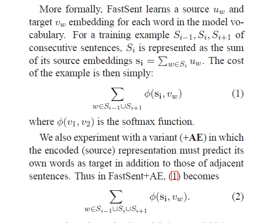

## 简介 
paper: [Learning Distributed Representations of Sentences from Unlabelled Data](https://arxiv.org/abs/1602.03483)

code: https://github.com/fh295/SentenceRepresentation

## method  

### 摘要  
1. Deeper, more complex models are preferable for representations to be used in supervised systems,
2. shallow log-linear models work best for building representation spaces that can be decoded with simple spatial distance metrics.(感觉说的是无监督)
### 提了两个方法
1. SDAE(Sequential Denoising Autoencoders)
2. FastSent

### SDAE
从DAE(denoising autoencoders)衍化而来，其实就是autoencoder,给序列加点噪音，然后recover the original data,该方法常用与CV领域，
文章提供了两种noise function,第一种是以一定概率删除部分token， 第二种是以一定的概率swap两个token,然后recover the original data
源代码我没来得及看,因为是基于theano框架的
### FastSent
该方案是基于SkipThought vector衍化而来，论文之处SkipThought的缺点是训练缓慢，改善的方法是使用BOW的方案。具体的公式如下:
  

这里说的softmax和我们用的略微不同，也就是说去当前句子所有token embedding的平均值(**也就是最终获取的sentence embedding**)，然后对于context上下文中的每个词，做向量内积，然后需要其越大越好

但是在代码里面实际操作的过程中，当前句子的sentence embedding 做softmax时，分母是词表中所有token的 word embedding和其做内积，这个复杂度太高。
在最终的代码实现过程中，使用的是word2vec的bow的方案，利用霍夫曼树做优化的，仅仅是将 sentence embedding 和 context 中token的word embedding作为内积之后，直接过一个sigmoid后然就利用霍夫曼树去计算损失了。  

### Conclusion
1. 论文做了多组实验，最终结论就是摘要里面点到的：具体任务针对具体模型，有的任务基于监督学习好点，反之有的对无监督友好（并不是说某个模型就可以完全训练处最好的 sentenece embedding）
2. 论文提出的fastsent模型，基于BOW（文本无序）,在部分任务中效果也挺好
3. DictRep（反转字典）表现最好