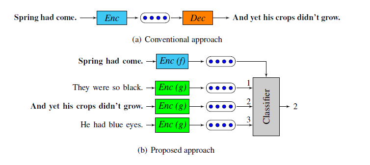

## 简介

paper: [An efficient framework for learning sentence representations](https://arxiv.org/abs/1803.02893)

code: 

https://github.com/lajanugen/S2V 

https://github.com/RottenFruits/quick-thought-in-pytorch

## method  

### 摘要

摘要上来就点到， we reformulate the problem of **predicting the context** in which a sentence appears as a classification problem
就是将skip-thought生成式问题转化为分类问题

同样点到，Encoder-decoder based sequence models are known to work well, but they are slow to train on large amounts of data. On the other hand,
bag-of-words models train efficiently by ignoring word order.(skip-thought太难训练， fastsent基于bow,但是没有词序)

### Framework

### code
- 在分类的时候是怎么采样的呢？感觉有的代码意思是多分类，（最近邻的为一类，滑动窗口内部的算为一类，毫不相关的算为一类）
- 论文里面是分为三类貌似，previous sentence、next sentence、others
- 或者在batch内部进行采样，其他句子可以作为当前句子的负样本