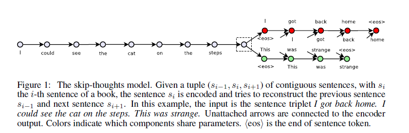

## 简介 
paper: [Skip-Thought Vectors](https://arxiv.org/abs/1506.06726)

code: https://github.com/ryankiros/skip-thoughts

## method  

### 摘要  
1. Using the continuity of text from books, we train an **encoderdecoder** model that tries to reconstruct the surrounding sentences of an encoded passage,
2. 提出了一种 vocabulary expansion method, 也就是解决UNK的token(毕竟2015年的论文)
### Framework

### code
在代码实现层面，我使用了GRU,也使用了BART架构来做，但是由于BookCorpus数据集缺少的原因，模型没有训练好，后续有了大量的该数据集，可以尝试下
